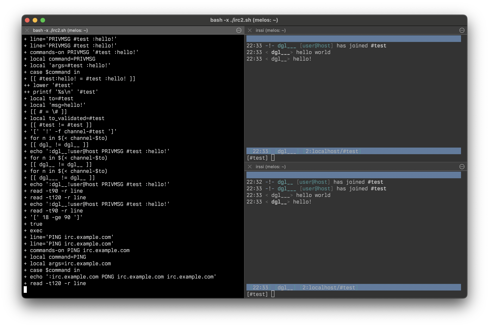

# A bash IRCd 🐣 💬

[This](./ircd.sh) is an IRC server written in bash. It is nearly "pure" bash,
because it does not use any external commands. But it does cheat slightly by
using some loadable builtins.



Credit to [YSAP](https://www.youtube.com/@yousuckatprogramming) for
[bash-web-server](https://github.com/bahamas10/bash-web-server).

## Running

```
./ircd.sh
```

Connect to localhost:6667 with an IRC client. If using Irssi you need to use
`/connect -nocap localhost`.

## Architecture 🏗️

The "accept" loadable bash builtin makes it possible to listen on a socket. See
the very end of the script for that.

Then "process-client" runs as another process with STDIN set to the client
(this means "echo" to send to the client just works). Nicknames are kept by a
"user-XXX" FIFO on the filesystem. Once the client has registered another
process ("watcher") that reads from that FIFO and writes to the client is
started, this means other clients can directly write to the FIFO, which in turn
directly writes to the user's connection.

Watcher also is responsible for sending PINGs, which means if process-client
hits a timeout, it exits, as the client should have sent a ping back already.

Channels are a nickname per line and are simply expanded when needing to send
to them.

## Security 🔐 🚨

I suspect this has some hilarious security holes. You could put stunnel in
front of it to make it do TLS, but that's like putting lipstick on a pig.

## Contributing 🧑‍💻

PRs welcome. This so far has been written without any AI, please disclose any
usage.
